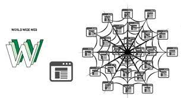

<html>
	<head>
		<meta charset="uft-8" />
		<link rel="stylesheet" href="style6.css">
		<h1>
Ma page web!
</h1>
	</head>
	<body>
		<h2><strong>Salut!</strong></h2>
		   
		   <h2><th><li>1er Chapitre: Python et algorithme.</li></th></h2>
		    
		   <th><a href="https://juandavidcifuentes.github.io/juandavidcifuentes1.github.io/">
		   <button>Python</button>
		   </a></th>
		   <h2><th><li>2nd Chapitre: L'Internet.</li></th></h2>
		    
		   <th><a href="https://juandavidcifuentes.github.io/juandavidcifuentes2.github.io/">
		   <button>L'Internet</button>
		   </a></th>
		   <h2><th><li>3eme Chapitre: Le Web.</li></th></h2>
		    
		   <th><a href="https://juandavidcifuentes.github.io/juandavidcifuentes3.github.io/">
		   <button>Le Web</button>
		   </a></th>
		   <h2><th><li>4eme Chapitre: Les Réseaux Sociaux.</li></th></h2>
		    
		   <th><a href="https://juandavidcifuentes.github.io/juandavidcifuentes4.github.io/">
		   <button>Reseaux Sociaux</button>
		   </a></th>
		   <h2><th><li>5eme Chapitre: Le Traitement de données.</li></th></h2>
		    
		   </a></th>
		   <h2><th><li>6eme Chapitre: La photographie Numerique.</li></th></h2>
		    
		   </a></th>
		   <h2><th><li>7eme Chapitre: Le Géolocalisation.</li></th></h2>
		    

		   <h2><th><li>8eme Chapitre: Les Objets Connectées.</li></th></h2>
		    
	</body>
</html>
